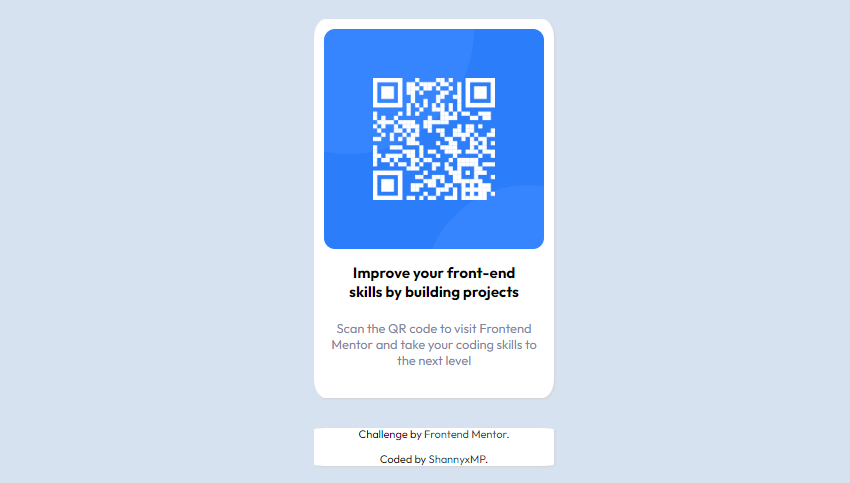

# Frontend Mentor - QR code component solution

This is a solution to the [QR code component challenge on Frontend Mentor](https://www.frontendmentor.io/challenges/qr-code-component-iux_sIO_H). Frontend Mentor challenges help you improve your coding skills by building realistic projects. 

## Table of contents

- [Overview](#overview)
  - [Screenshot](#screenshot)
  - [Links](#links)
- [My process](#my-process)
  - [Built with](#built-with)
  - [What I learned & Continued Development](#what-i-learned-&-continued-development)
- [Author](#author)

## Overview

### Screenshot

### Links

- Live Site URL: [GitHub](https://shannyxmp.github.io/Frontend-Mentor-QR-Code-Challenge/)

## My process

### Built with

- Semantic HTML5 markup
- CSS custom properties
- Flexbox
- CSS Grid
- Mobile-first workflow

### What I learned & Continued development

This project was a fun way to test my knowledge of HTML and CSS. As you can see, my QR code comes close to the design, but not without a few challenges. My first challenge was calculating a suitable width for the box that contains the QR image and text, as they needed to be legible and flexible to a viewer's preferences and viewport. Through trial and error, I believe I obtained a suitable size while avoiding the elements from being too cramped. Speaking of, this led to my second hurdle: margins versus padding.

This project made me realise that I did not thoroughly understand the Box Model - constantly switching between using padding or margins to create space within the box and make it pleasing to the eye. I had to review my notes and revisit the MDN Web Docs to understand what to choose over the other. 

MDC Web Docs helped me learn CSS values that I had not drilled down on. In particular, border radius and shadow. Ultimately, choosing what I thought was close to the original design, I am keen on integrating this newly found tips in future projects. 

## Author

- Website - [ShannyxMP](Site: TBA)
